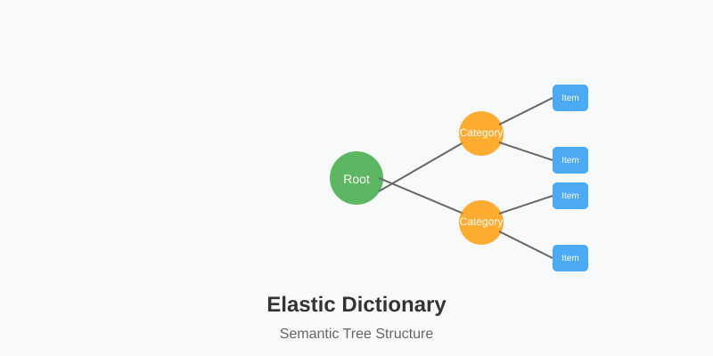

# Elastic Dictionary

An adaptive, hierarchical data structure that dynamically organizes string data and text into a semantic tree structure, now with a full-featured web interface.



## Overview

The Elastic Dictionary is a semantic data structure that:
- Organizes text entries based on meaning
- Creates a hierarchical structure automatically
- Adapts and evolves as new data is added
- Provides powerful visualization capabilities

This project includes both the core Elastic Dictionary implementation and a complete web application with a FastAPI backend and React frontend.

## Features

### Core Functionality
- **Dynamic Organization**: Elements find their natural place in a hierarchical structure
- **Semantic Understanding**: Uses embeddings to understand meaning and relationships between entries
- **Adaptive Structure**: Tree evolves and reorganizes as new data is added
- **Support for Different Data Types**: Handles simple strings, lists, and paragraphs

### Web Application
- **Interactive 3D Visualization**: Dynamic graph with visible node labels and customizable appearance
- **Data Management**: Add single items, multiple items, or paragraphs to the dictionary
- **Semantic Search**: Find items in the dictionary based on meaning, not just exact matches
- **Real-time Updates**: Live visualization updates as items are added
- **Dictionary Management**: Reset the entire dictionary or delete specific nodes
- **Tree Reorganization**: Automatic restructuring when nodes are deleted
- **Responsive UI**: User-friendly interface with tabbed navigation

### Visualization Capabilities
- **Multiple Layout Options**: 2D and 3D visualizations with various layout algorithms
- **Rich Visual Encoding**: Color, size, and shape to represent node properties
- **Interactive Exploration**: Zoom, rotate, and click to explore the structure
- **Customizable Appearance**: Control node sizes, colors, and layout parameters

## Project Structure

```
elastic-dict/
├── backend/                 # FastAPI backend (as a submodule)
│   ├── app/                # Application code
│   │   ├── api/           # API routes
│   │   ├── core/          # Core components
│   │   ├── models/        # Data models
│   │   └── services/      # Business logic
├── data/                   # Data storage
├── frontend/              # React frontend
│   ├── public/            # Static assets
│   └── src/               # Source code
│       ├── components/    # React components
│       └── services/      # API services
└── README.md             # Project documentation
```

## Installation

### Prerequisites
- Python 3.8+
- Node.js 14+
- npm or yarn
- Git (for submodule management)

### Backend Setup

1. Clone the repository with submodules:

```bash
git clone --recursive https://github.com/yourusername/elastic-dict.git
cd elastic-dict
```

2. If you already cloned without submodules:

```bash
git submodule update --init --recursive
```

3. Set up the backend:

```bash
cd backend
pip install -r requirements.txt
```

4. Run the FastAPI backend:

```bash
python elastic_dict.py
```

The API will be available at http://localhost:8000.

### Frontend Setup

1. Navigate to the frontend directory:

```bash
cd frontend
```

2. Install the required npm packages:

```bash
npm install
```

3. Run the development server:

```bash
npm run dev
```

The frontend will be available at http://localhost:5173.

## Usage

### Using the Web Interface

1. **Adding Items**:
   - Navigate to the "Add Items" tab
   - Choose between adding a single item, multiple items, or a paragraph
   - Enter your text and submit

2. **Searching**:
   - Navigate to the "Search" tab
   - Enter a search query
   - View semantically related items

3. **Visualizing**:
   - The 3D graph visualization is always visible at the top
   - It updates in real-time as you add items
   - Click on nodes to see details

4. **Managing the Dictionary**:
   - Navigate to the "Settings" tab
   - To delete a specific node:
     - Search for the node using the search box
     - Select the node from the search results
     - Click "Delete This Node" and confirm
   - To reset the entire dictionary:
     - Click "Reset Dictionary" and confirm

### Using the Python Library

```python
from elastic_dict import ElasticDictionary

# Create a new elastic dictionary
ed = ElasticDictionary()

# Add single elements
ed.add("apple")
ed.add("banana")
ed.add("orange")

# Add a list of elements
ed.add_batch(["computer", "keyboard", "mouse"])

# Add a paragraph
ed.add_paragraph("Machine learning is a subset of artificial intelligence that focuses on developing systems that learn from data.")

# Search for related items
results = ed.find("fruit")
for node, similarity in results:
    print(f"{node.key}: {similarity:.2f}")

# Visualize the tree
ed.visualize()

# Create interactive 3D visualization
fig = ed.visualize_interactive()
fig.write_html("visualization.html")
```

## Documentation

- [Backend Documentation](backend/README.md)
- [Frontend Documentation](frontend/README.md)
- [Visualization Guide](docs/visualization.md)
- [API Documentation](http://localhost:8000/docs) (when backend is running)

## Contributing

1. Fork the repository
2. Create your feature branch (`git checkout -b feature/amazing-feature`)
3. Commit your changes (`git commit -m 'Add some amazing feature'`)
4. Push to the branch (`git push origin feature/amazing-feature`)
5. Open a Pull Request

## License

This project is licensed under the MIT License - see the [LICENSE](LICENSE) file for details.

## Acknowledgments

- Thanks to all contributors who have helped shape this project
- Built with FastAPI, React, and Three.js
- Powered by sentence-transformers for semantic analysis 